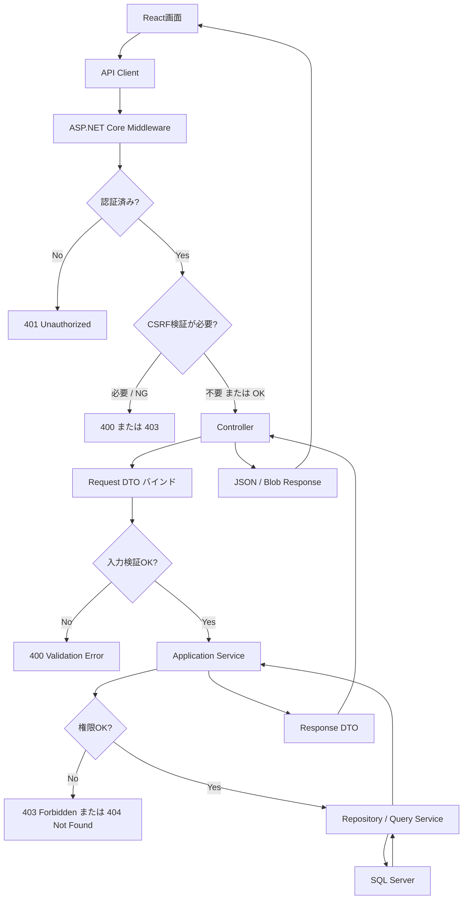
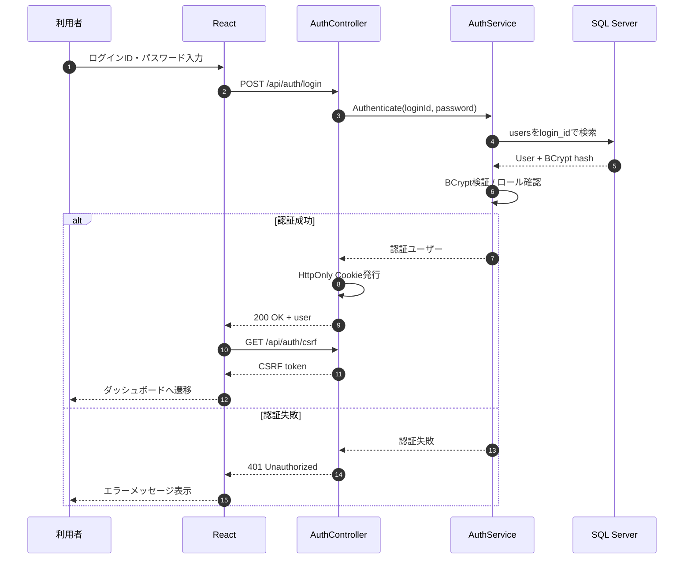
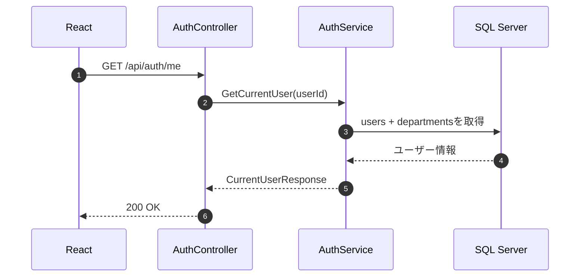
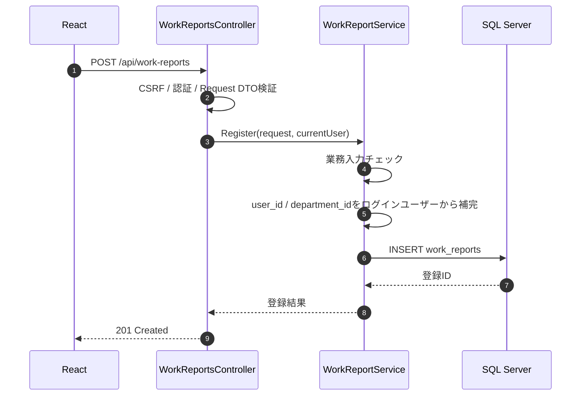
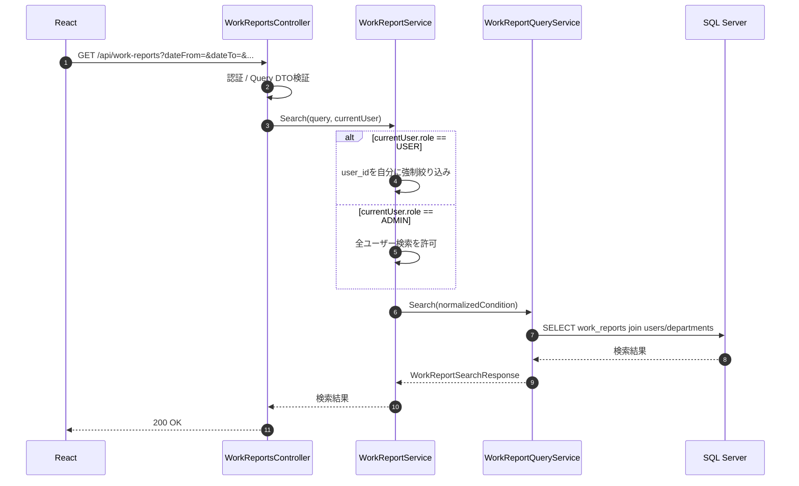
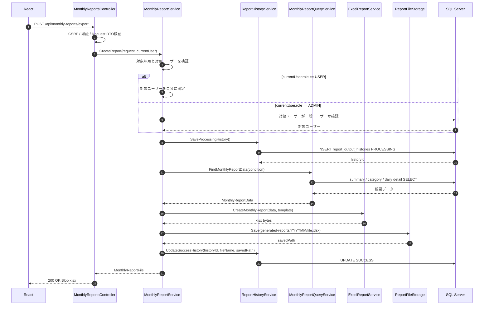
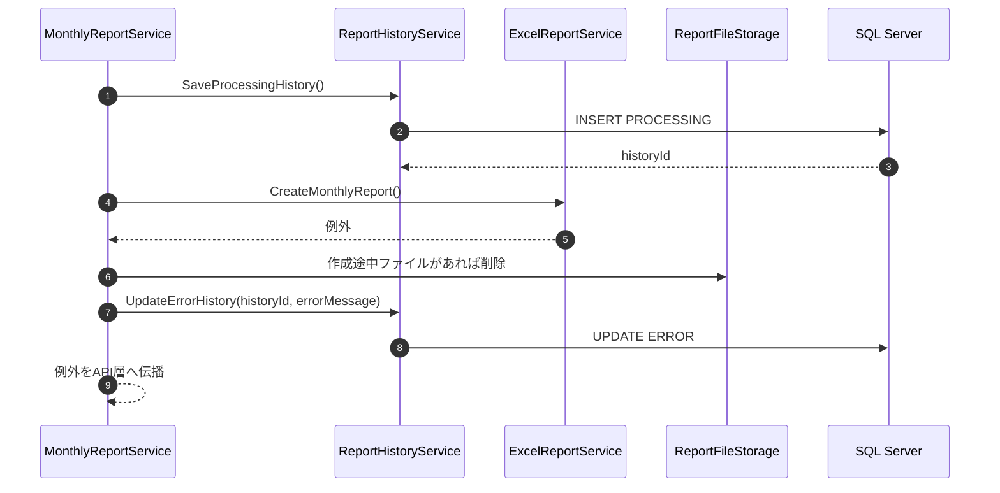
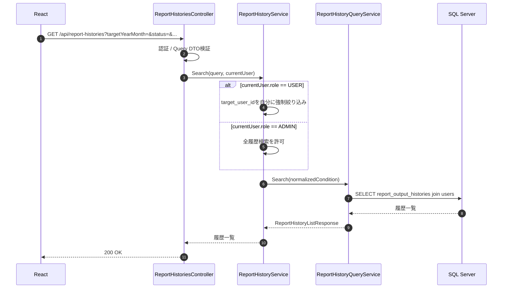
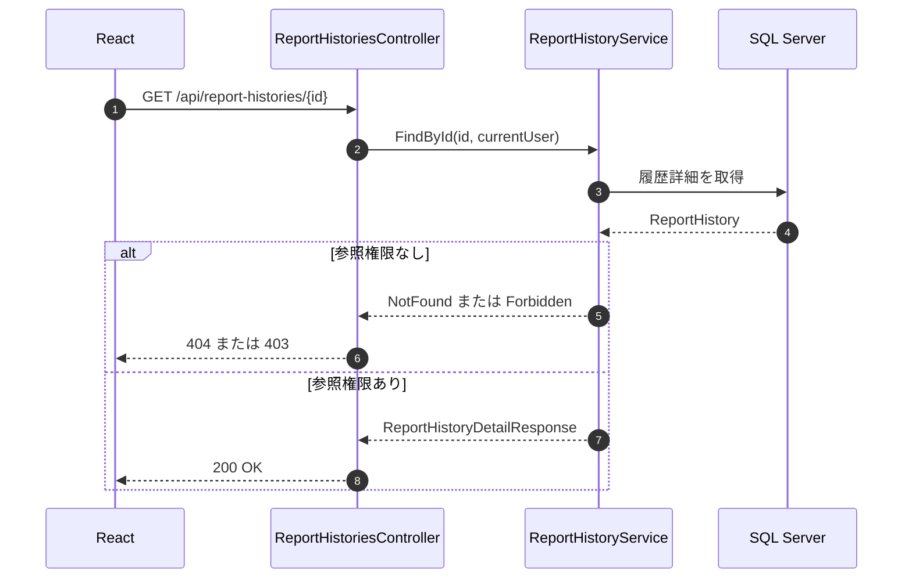
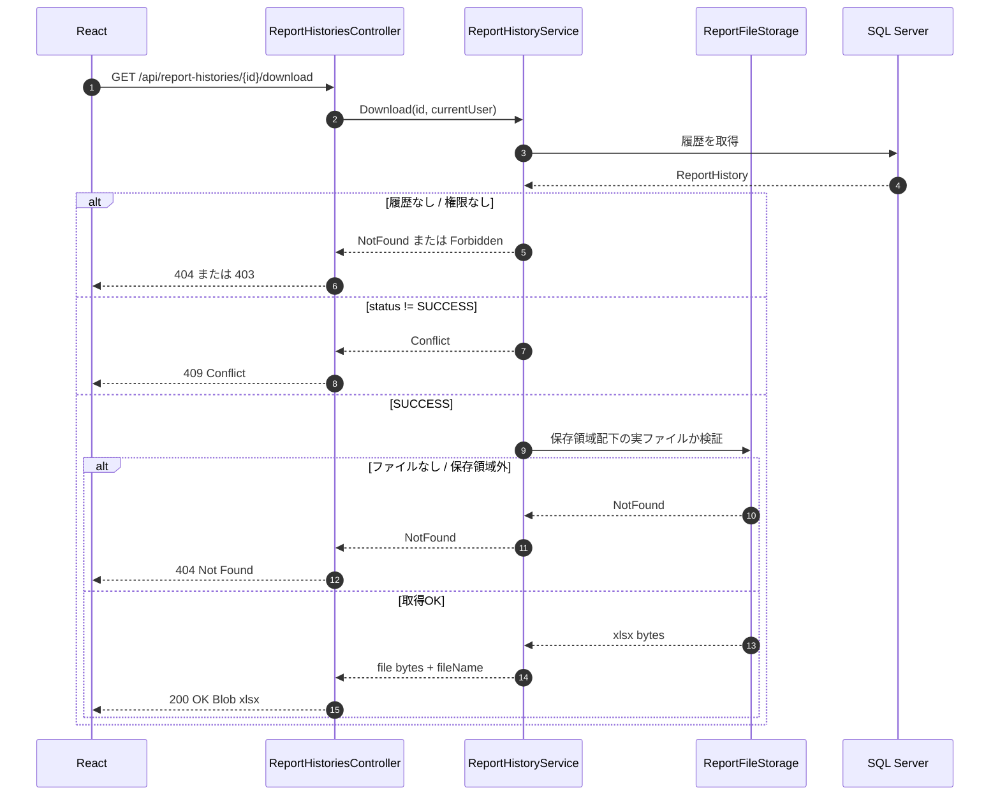

# 09. API処理フロー

## 目的

React、ASP.NET Core Web API、SQL Serverへ移行した後の主要API処理フローをMermaidで整理します。実装時はこの流れをベースに、Controller、Application Service、Repository、帳票サービス、ファイル保存の責務を分離します。

バックエンド内部のレイヤ別シーケンスは [10-backend-layer-sequence.md](10-backend-layer-sequence.md) に整理します。

## 共通APIパイプライン

## ログイン

## ログインユーザー取得

## 作業日報登録

## 作業実績検索

## 月次報告書出力

## 月次報告書出力エラー時

## 帳票履歴検索・詳細

## 帳票再ダウンロード

## 実装時の責務境界

| 層 | 責務 |
|---|---|
| React | 画面表示、フォーム状態、API呼び出し、Blob保存、入力補助 |
| Controller | HTTPメソッド、DTOバインド、認証ユーザー取得、ステータスコード |
| Application Service | 業務入力チェック、権限補正、トランザクション、補償処理 |
| Repository / Query Service | SQL Serverアクセス、バインド変数、検索条件、Row mapping |
| ExcelReportService | テンプレート読み込み、セル設定、行追加、書式維持 |
| ReportFileStorage | 保存先解決、ファイル名検証、保存、読み込み、保存領域外アクセス防止 |

## 注意点

- React側の表示制御だけで権限を守らず、API側で必ず `ADMIN` / `USER` の制約を再評価します。
- 月次帳票出力はDB更新とファイル保存をまたぐため、失敗時の `ERROR` 更新と作成途中ファイル削除を明示します。
- 他人の帳票履歴へのアクセスは、情報秘匿を優先する場合 `403` ではなく `404` を返す方針も検討します。
- 同期ダウンロードでタイムアウトが見える場合は、非同期ジョブ化し、`PROCESSING` 履歴をポーリングする方式へ拡張します。
