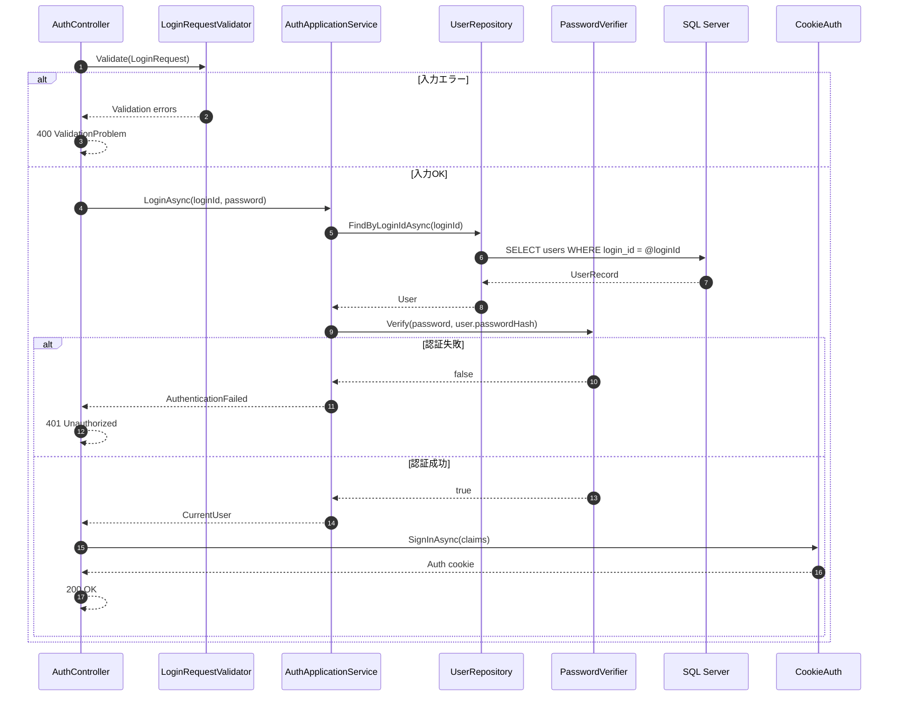
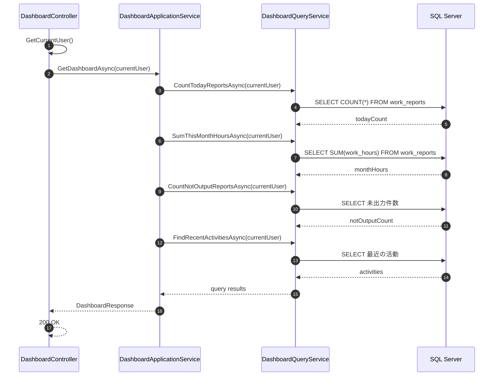
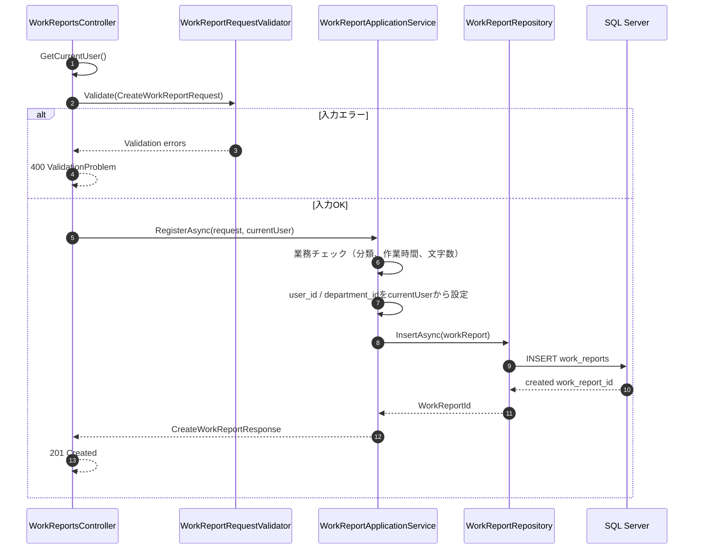
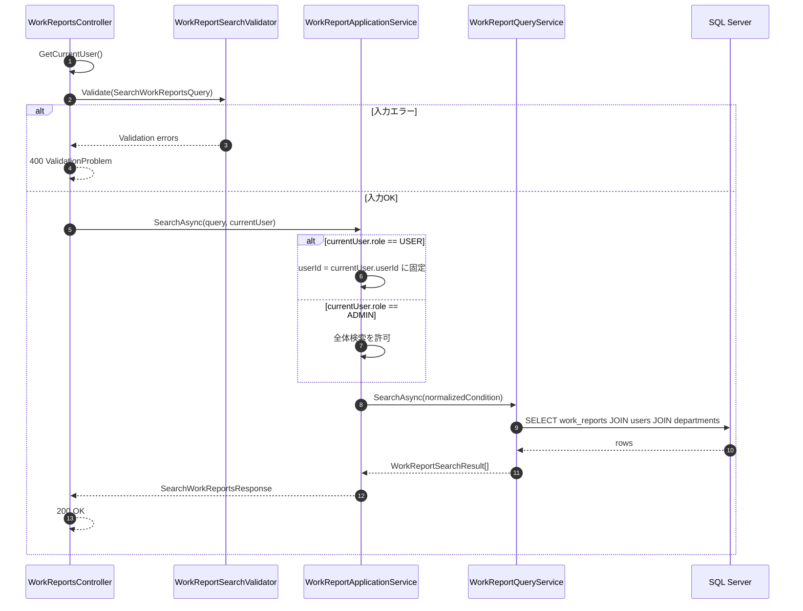
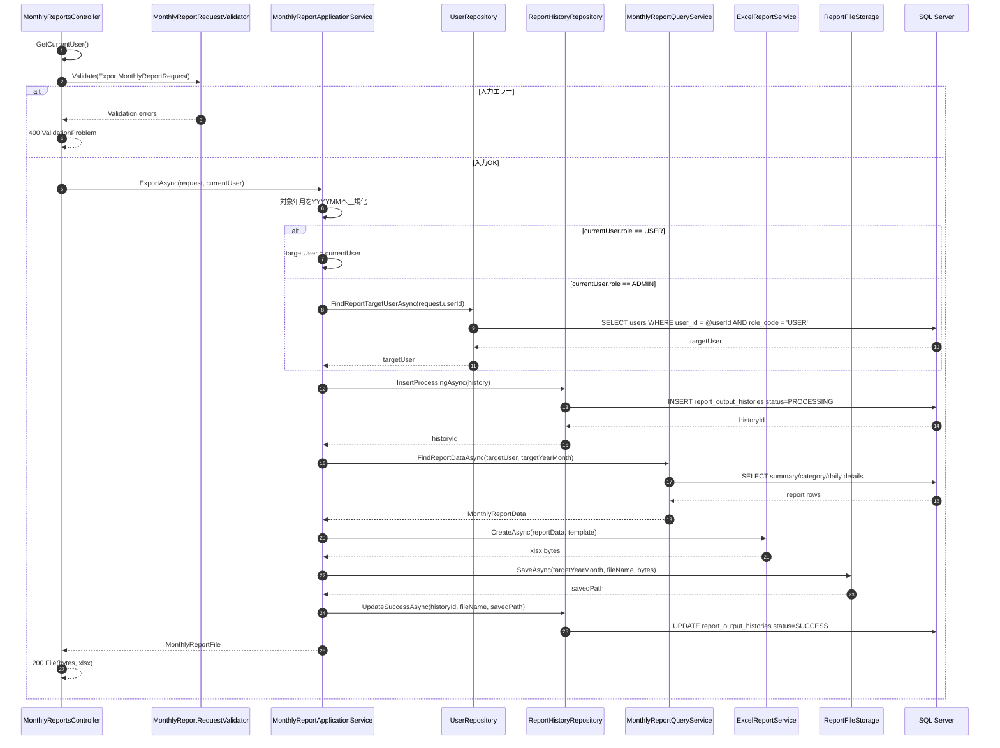
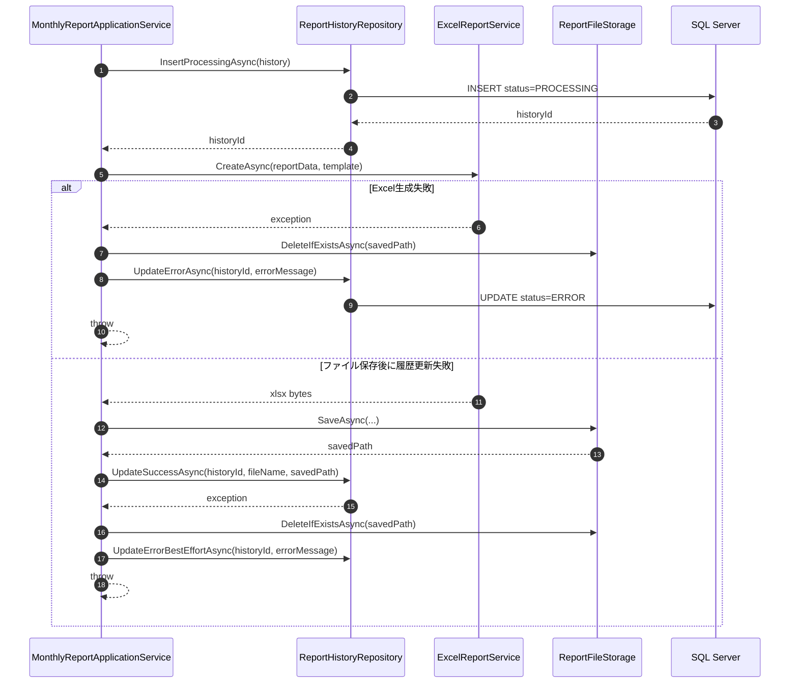
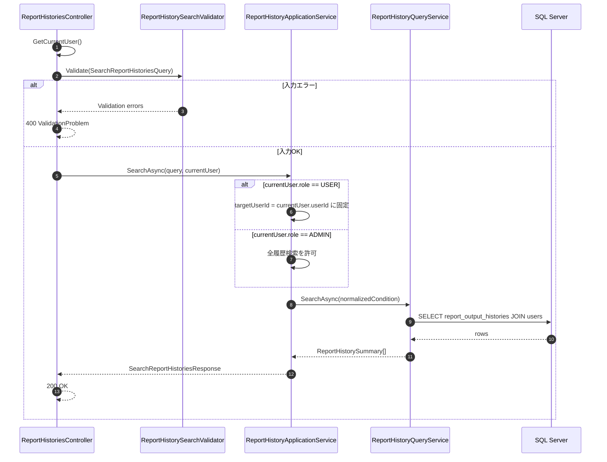
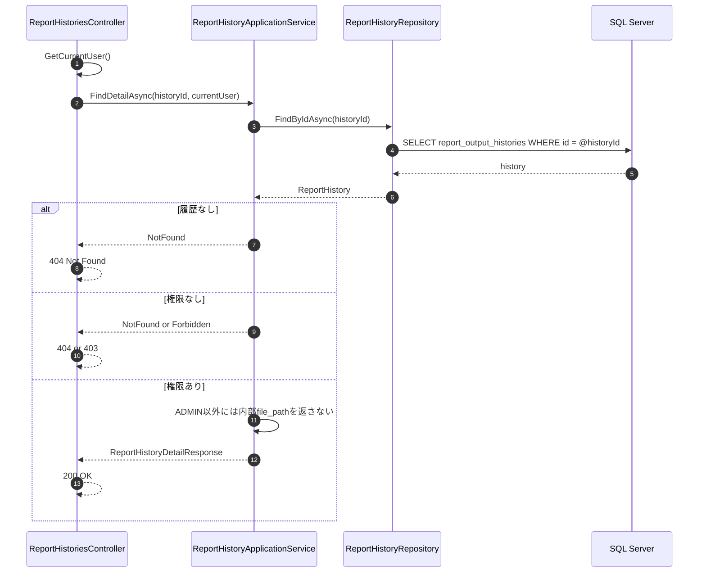
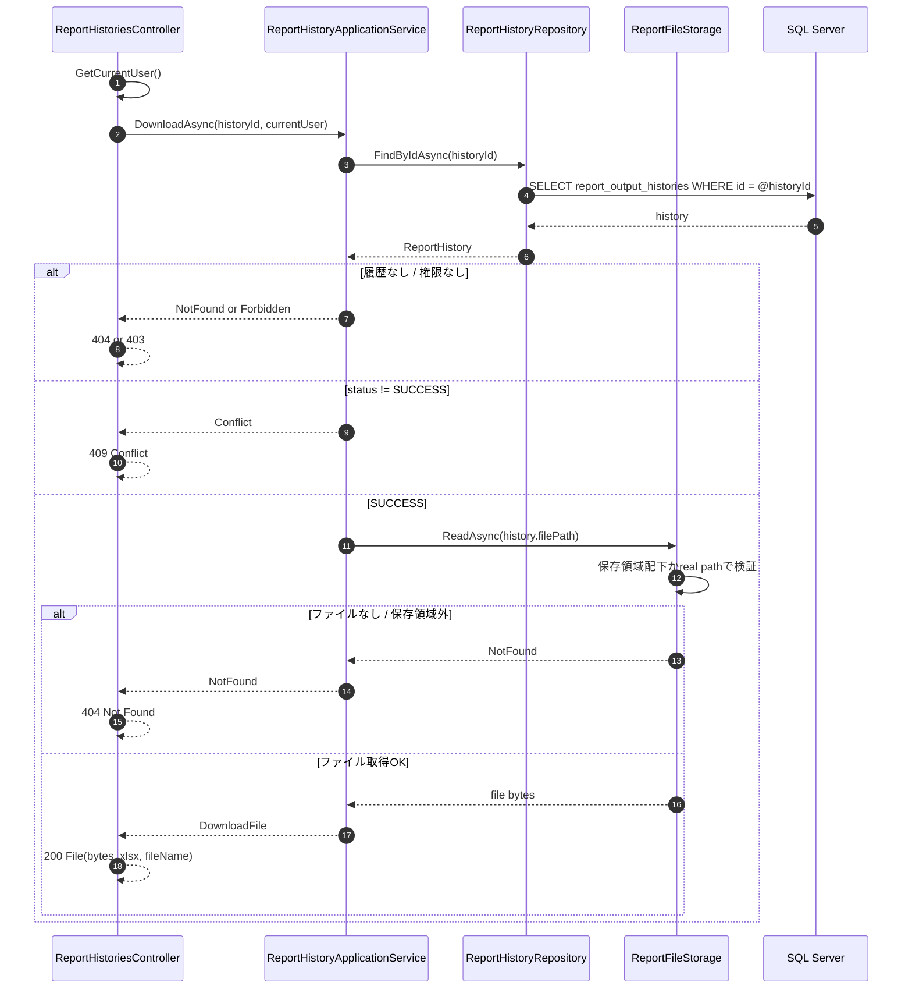
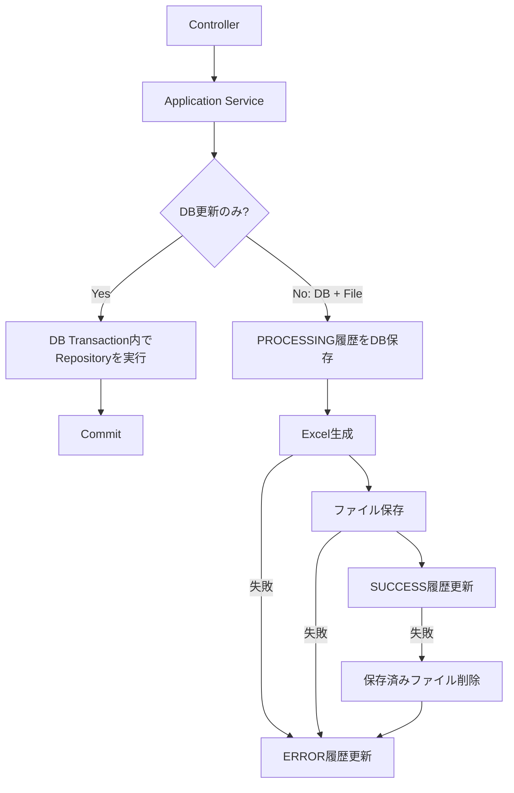

# 10. バックエンドレイヤ別シーケンス図

## 目的

ASP.NET Core Web APIへ移行した後のバックエンド内部処理を、レイヤごとの責務が分かる形で整理します。Reactから見たAPI呼び出しの流れは [09-api-processing-flow.md](09-api-processing-flow.md) を参照し、このドキュメントではAPIサーバー内部の Controller、Application Service、Repository、SQL Server、帳票、ファイル保存の分担に焦点を当てます。

## レイヤ構成

| レイヤ | 主な責務 |
|---|---|
| Controller | HTTP入出力、認証ユーザー取得、DTOバインド、ステータスコード |
| Request Validator | DataAnnotationsまたはFluentValidationによる形式チェック |
| Application Service | 業務ルール、権限補正、トランザクション、補償処理 |
| Repository / Query Service | SQL Serverアクセス、SQL、バインド変数、行マッピング |
| Domain / Policy | ロール判定、業務状態判定、値オブジェクト |
| Reporting Service | Excelテンプレート読み込み、セル差し込み、`.xlsx` 生成 |
| File Storage | 保存先解決、ファイル名検証、保存、読み込み、削除 |

## 認証

## ダッシュボード取得

## 作業日報登録

## 作業実績検索

## 月次報告書出力

## 月次報告書出力の補償処理

## 帳票履歴検索

## 帳票履歴詳細

## 帳票再ダウンロード

## トランザクション境界

## 実装ルール

- ControllerにSQL、ファイルパス検証、帳票生成ロジックを書きません。
- Application Serviceはログインユーザーを受け取り、`ADMIN` / `USER` の制約を必ず再評価します。
- Repository / Query ServiceはSQL Server向けSQLとパラメータバインドを担当します。
- Reporting ServiceはExcelテンプレートと出力データだけを受け取り、DBやHTTPに依存しません。
- File Storageは保存領域外アクセス防止を担当し、Application Serviceは直接ファイルシステムを触りません。
